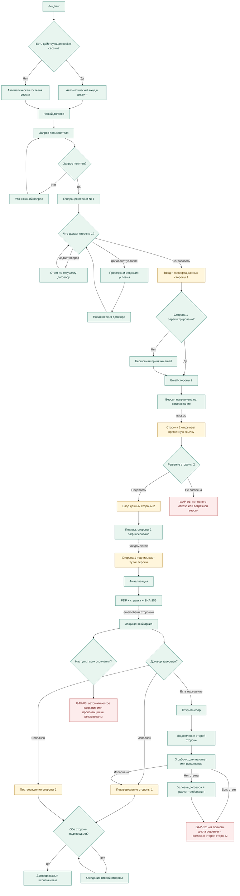

# Жизненный цикл договора AI-Arbitr

Версия спецификации: 1.0  
Соответствует приложению: `0.9.3-beta`

`party_1` и `party_2` обозначают только порядок участия: создателя и получателя проекта. Юридические роли выбираются отдельно. Например, создатель договора найма может быть как Наймодателем, так и Нанимателем; контрагенту автоматически назначается противоположная роль.

Дата проверки: 17 сентября 2026 года

Этот документ является контрольной схемой продукта. Изменение клиентского пути считается завершенным только после обновления схемы, тестового протокола и прохождения затронутых сценариев.

## Обозначения

- зеленый узел: реализованный завершенный шаг;
- желтый узел: ручной переход или внешняя зависимость;
- красный узел `GAP`: незавершенная ветка;
- пунктир: уведомление или передача управления между сторонами.

## Общая схема

## Состояния в базе

| Бизнес-состояние | `sessions.status` | Дополнительный признак | Допустимое следующее действие |
|---|---|---|---|
| Новый черновик | `draft` | нет версий | отправить запрос |
| Версия создана | `in_review` | есть `contract_versions` | вопрос, новое условие, согласование |
| Направлен второй стороне | `in_review` | `invite_token`, сторона 2 `pending` | открыть ссылку |
| Подписан стороной 2 | `in_review` | сторона 2 `approved`, `signed_at` | подпись стороны 1 |
| Подписан обеими сторонами | `finalized` | обе стороны `approved`, `finalized_at` | исполнение или спор |
| Ожидает второго подтверждения исполнения | `finalized` | один `completed_at` | подтверждение второй стороны |
| Закрыт исполнением | `finalized` | `is_completed=true`, оба `completed_at` | только просмотр архива |

## Инварианты

Эти правила должны выполняться при каждом релизе:

1. Переход с лендинга не требует входа: действующая сессия восстанавливается, новый браузер получает гостя.
2. Сторона 2 может подписать только версию, направленную на ее email.
3. Подпись стороны 2 не финализирует договор без подписи стороны 1.
4. Финальный PDF строится из той же редакции, которую подписали обе стороны.
5. После финализации договор нельзя удалить или редактировать.
6. Закрытие исполнением требует подтверждения обеих сторон.
7. Ответ на уведомление о споре может дать только другая сторона, а продолжить спор может его инициатор.
8. Каждая новая версия договора содержит версию приложения, идентификатор и редакцию шаблона.
9. Любой незавершенный альтернативный путь должен быть отмечен на схеме как `GAP`, а не скрыт сообщением интерфейса.

## Реестр разрывов

| ID | Разрыв | Риск | Условие закрытия |
|---|---|---|---|
| `GAP-01` | У второй стороны нет явной кнопки отказа и встречной редакции | договор зависает в `in_review` | отказ фиксируется или создается версия № N+1 |
| `GAP-02` | Нет завершенного цикла решения по спору и подтверждения второй стороны | спор нельзя формально закрыть | решение, доставка, согласие/возражение, исполнение или переход в суд |
| `GAP-03` | Нет структурированной даты окончания и автоматической пролонгации | договор остается активным бессрочно в интерфейсе | даты хранятся структурированно, фоновая задача закрывает или продлевает договор |

## Правило изменения логики

Любая новая функция должна либо вести в существующее конечное состояние, либо добавлять новое конечное состояние в эту схему. Узел без исходящего перехода допустим только для `Закрыт исполнением`, `Передан в суд`, `Прекращен` или явно зарегистрированного `GAP`.
